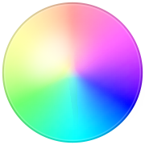

# Colorna.me Website

Repository for [colorna.me](https://colorna.me)

A little tool to get the name for a color value (hex, rgb, hsl).

The color names are taken from [name-that-color](http://chir.ag/projects/name-that-color/#6195ED) but will be adapted over time.

If you want to add/specify color names, just do a pull request 😼

## Built with
  + [Vue.js](https://vuejs.org/)
    As the frontend framework
  + [name-that-color](http://chir.ag/projects/name-that-color/#6195ED)
    Origin for the color names
  + [tinycolor](https://github.com/bgrins/TinyColor)
    Javascript color tooling
  + [copy-to-clipboard](https://github.com/sudodoki/copy-to-clipboard)
    To copy the color name to clipboard
  + [rangy](https://github.com/timdown/rangy)
    Save and restore cursor position for input fields
    > I wanted a hint of syntax-highlighting for the color input field,
    > so I had to use a `contenteditable` field.
    > Programmaticaly changing this field and wrapping characters in `spans`
    > would reset the cursor to the start of the field.
    > With rangy the cursor postion could be restored.
  + [vue-github-corners](https://github.com/Roeefl/vue-github-corners)

## Thanks to

[netlify](https://www.netlify.com) for their free open-source hosting and CI 🙏
